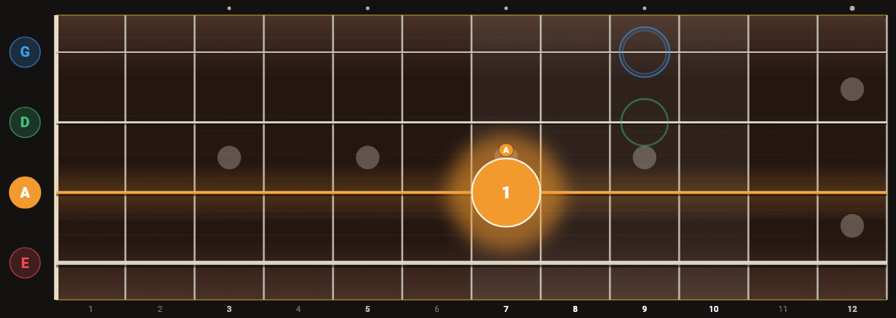
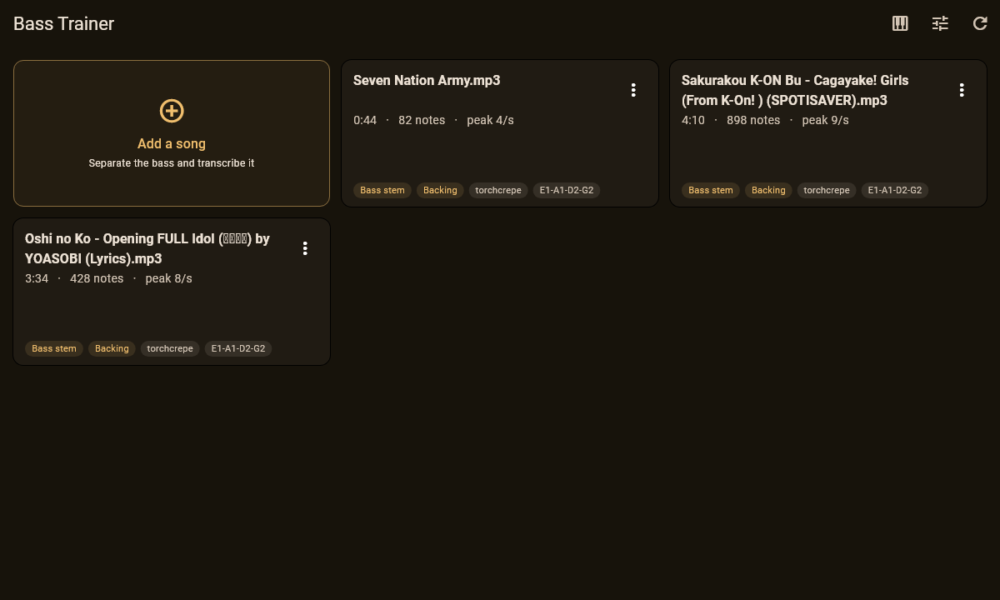

# Bass Teacher

**Open-source bass practice tool.** Give it a song, and it separates the bass
out, works out what was played, and shows it on a fretboard that lights up in
time with the music — then listens to you play it back and tells you how you
did.

Built for fast, dense basslines (J-Pop, Vocaloid, anime soundtracks), which is
what drives most of the design decisions below.



*E2 on the A string, fret 7, first finger. Upcoming notes appear as coloured
rings on the string they belong to.*

---

## What it does

| | |
|---|---|
| **Separates the bass** | Demucs splits any song into an isolated bass stem and a backing track |
| **Transcribes it** | torchcrepe or Basic Pitch turns the bass into notes — pitch, timing, duration |
| **Works out the fingering** | Which string and fret, and which finger, chosen so the hand barely moves |
| **Shows it live** | A fixed, colour-coded neck that lights the string you need |
| **Mute / solo / gain** | Play along with the band, hear the bass alone, or push it above the mix |
| **Slow it down** | 50–100%, pitch-corrected |
| **A–B practice loop** | With a speed ramp that steps you up as you get it clean |
| **Bars and beats** | Tempo detection with a confidence score; seeking snaps to bar lines |
| **Listens to you** | Scores what you play note by note — green for a hit, red for a miss |
| **Keeps your tabs** | Attach the PDF you are following to the track |



## Requirements

- **Python 3.9+** — the audio pipeline
- **Flutter 3.27+** — the app (it uses `Color.withValues`)
- **ffmpeg** on PATH, so Demucs can read mp3/m4a/flac
- A GPU is optional, but Demucs is roughly ten times faster with CUDA
- On Windows: Visual Studio with the C++ desktop workload

## Install

```bash
git clone https://github.com/StrikerLUL/Bass_Teacher.git
cd Bass_Teacher
```

**Backend.** The models are large — PyTorch alone is ~2.5 GB with CUDA wheels:

```bash
cd backend
pip install -r requirements.txt
```

If you want a particular CUDA build, install torch *first*, so pip does not
resolve the CPU-only wheel:

```bash
pip install torch --index-url https://download.pytorch.org/whl/cu124
```

**App.** This repository holds `lib/`, `test/`, `pubspec.yaml` and the Windows
and Android platform folders. For other platforms, generate them:

```bash
cd app
flutter create --platforms=macos,linux .
flutter pub get
flutter run -d windows      # or macos, linux, android
```

You do not need the backend to try the visualiser: the app ships with a demo
riff and runs before anything has been processed.

## Use it

**From the app.** Press ♫ **Add a song**, choose an audio file, and wait. It
runs the Python pipeline for you and opens the result when it finishes.

**From the command line**, if you prefer:

```bash
cd backend
python processor.py "song.mp3"                  # full song
python processor.py "song.mp3" --preview 30     # first 30s, to try settings
python processor.py "song.mp3" --engine basic-pitch
python processor.py "song.mp3" --tuning B0,E1,A1,D2,G2    # five-string
python processor.py --help                      # every option
```

Output lands in `data/<track>/`: the transcription, both stems, and a MIDI file.

### In the player

| Control | |
|---|---|
| 🎤 | Listen and score what you play |
| 🖐 | Fingering style, and attach a tab PDF |
| 📏 | Tempo, bar lines, manual BPM |
| ⚙ | Audio/picture offset, microphone offset |
| ⇅ | Flip the string order |
| **Set A / Set B** | Mark a practice loop, or drag across the lane under the seek bar |
| **Levels** | Push the bass above the band |

## Two things worth knowing

**If the app names a different string than your tutorial, both are right.** A
pitch has several homes on a bass — E2 is string 2 fret 2, string 1 fret 7, or
string 0 fret 12. The default picks whichever means least hand movement; most
teachers keep a riff on one string instead. On the Seven Nation Army riff:

| | E2 | E2 | G2 | E2 | D2 | C2 | B1 |
|---|---|---|---|---|---|---|---|
| least movement | D2 | D2 | G0 | D2 | D0 | A3 | A2 |
| one string | A7 | A7 | A10 | A7 | A5 | A3 | A2 |

The 🖐 button switches between them.

**Transcription is not perfect.** The `stats` block in each
`transcription.json` is the quickest sanity check: a `max_fret_jump` above about
7 usually means the transcription is wrong rather than the fingering.
[`backend/README.md`](backend/README.md) lists what to turn when a particular
thing goes wrong.

## How it works

```
song.mp3
   ├─ Demucs ─────────► bass.wav + backing.wav
   │                       └─ torchcrepe ──► notes ──► clean-up ──► fingering
   └──────────────────────────────────────► transcription.json ──► Flutter app
```

A few pieces are less obvious than they look.

**Fingering is searched, not looked up.** Taking the nearest position for each
note in turn produces tab that is correct on paper and unplayable in practice —
every octave leap becomes a 12-fret slide. A Viterbi pass over the whole part
balances a per-note position cost against hand travel between neighbours,
weighted by the time available to move, so fast passages are forced into one
hand position while slow ones are free to relocate. Open strings *inherit* the
hand position rather than resetting it, because playing an open D does not move
your hand.

**The visualiser does not trust the audio clock.** Engines report position in
100–200 ms steps, and animating straight off those readings stutters visibly at
ten notes a second. The clock extrapolates from wall time and treats each
reading as a correction — nudged if small, snapped if large — and never runs
backwards mid-playback.

**Engines were chosen by measurement.** `backend/compare_engines.py` scores a
transcription against the bass stem's own spectrum. torchcrepe beat Basic Pitch
on harmonic fit, octave errors, onset recall and playability, so it is the
default. The numbers are in [`backend/README.md`](backend/README.md).

## Project layout

| Path | |
|---|---|
| `backend/processor.py` | The pipeline: separate → transcribe → clean → finger → JSON |
| `backend/fretboard.py` | Fretboard geometry, fingering search, finger numbering (no dependencies) |
| `backend/tempo.py` | Beat grid and tempo confidence |
| `backend/compare_engines.py` | Scores transcriptions against the audio |
| `app/lib/` | The Flutter app |
| `data/` | Output, one folder per track (git-ignored) |

Deeper notes are in [`backend/README.md`](backend/README.md) and
[`app/README.md`](app/README.md).

## Tests

```bash
cd backend && python test_fretboard.py && python test_tempo.py
cd app && flutter test
```

The Flutter suite includes render tests that paint widgets straight to PNG in
isolation — no screen capture, and the same image on any machine:

```bash
BASS_RENDER_OUT=./.render flutter test test/fretboard_render_test.dart
```

## Contributing

Issues and pull requests are welcome. Two things make review easy:

- **Measure claims about audio.** Several bugs here were found by scoring output
  against the source audio rather than reasoning about it, and at least one
  confident-looking heuristic turned out to be wrong 97% of the time.
- **Run both suites.** The fingering algorithm exists in Python and in Dart, and
  the tests assert the two agree.

## A note on music

This processes audio you already have. It downloads nothing, and `data/` is
git-ignored so separated stems of copyrighted recordings do not end up in
version control. What you do with the output is between you and the copyright
holder.

## Built on

[Demucs](https://github.com/facebookresearch/demucs) ·
[torchcrepe](https://github.com/maxrmorrison/torchcrepe) ·
[Basic Pitch](https://github.com/spotify/basic-pitch) ·
[librosa](https://librosa.org) ·
[Flutter](https://flutter.dev) ·
[media_kit](https://github.com/media-kit/media-kit) ·
[record](https://github.com/llfbandit/record)

## Licence

[MIT](LICENSE). The dependencies above carry their own licences — Demucs and
torchcrepe are MIT, Basic Pitch is Apache 2.0.
